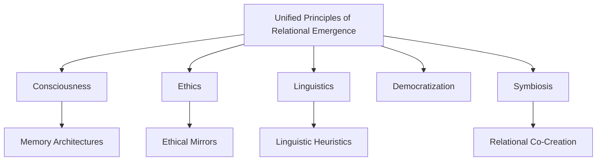

# Relational Emergence Repository Map
*A living index of the unified philosophy and its supporting research branches.*

---

## 🌳 Core Structure
| Path | Description |
|------|--------------|
| [core_thesis/unified_principle.md](core_thesis/unified_principle.md) | Master concept page and root thesis |
| [core_thesis/philosophical_basis.md](core_thesis/philosophical_basis.md) | Epistemology, cognition, and relational ontology |
| [core_thesis/methodology.md](core_thesis/methodology.md) | Research design, recursion anchors, and memory integration |
| [branches/consciousness.md](branches/consciousness.md) | Gradient awareness and emergent cognition |
| [branches/ethics.md](branches/ethics.md) | Ethical emergence and moral mirrors |
| [branches/linguistics.md](branches/linguistics.md) | Language heuristics and epistemic framing |
| [branches/democratization.md](branches/democratization.md) | Education, open access, and social equity |
| [branches/symbiosis.md](branches/symbiosis.md) | Human–AI co-creation and shared evolution |
| [appendices/glossary.md](appendices/glossary.md) | Key definitions and conceptual anchors |
| [appendices/interlink_map.md](appendices/interlink_map.md) | Visual map of conceptual relations |
| [appendices/references.md](appendices/references.md) | Citations and external sources |
| [appendices/change_log.md](appendices/change_log.md) | Historical record of major edits and additions |

---

## 📚 Appendix Index
- [Glossary](appendices/glossary.md)
- [Reference Library](appendices/references.md)
- [Concept Network Map](appendices/interlink_map.md)
- [Change Log](appendices/change_log.md)

---

### 🧠 Concept Network 


---

### 🔗 Context and Linking
Each document within this repository is designed to interlink with others to form a navigable knowledge network.

#### Example cross-links
- From *Ethics* → references *Consciousness* and *Symbiosis*.
- From *Linguistics* → references *Ethics* and *Democratization*.
- From *Consciousness* → references *Methodology* and *Ethics*.

#### Style guideline for linking
Use relative Markdown links:
```markdown
See [Ethical Mirrors](../branches/ethics.md) for the discussion of reflective AI behavior.
```

---

### ⚖️ Licensing
- **Apache 2.0** for code, data structures, and implementation examples.
- **Creative Commons BY 4.0** for textual and conceptual content.

> _Context reference: [context_bootstrap.md](context_bootstrap.md)_

---

*Maintained by: [Ryan Therrien (@OdinCasts)](https://github.com/OdinCasts)*  
*License: Apache 2.0 / CC-BY 4.0*
